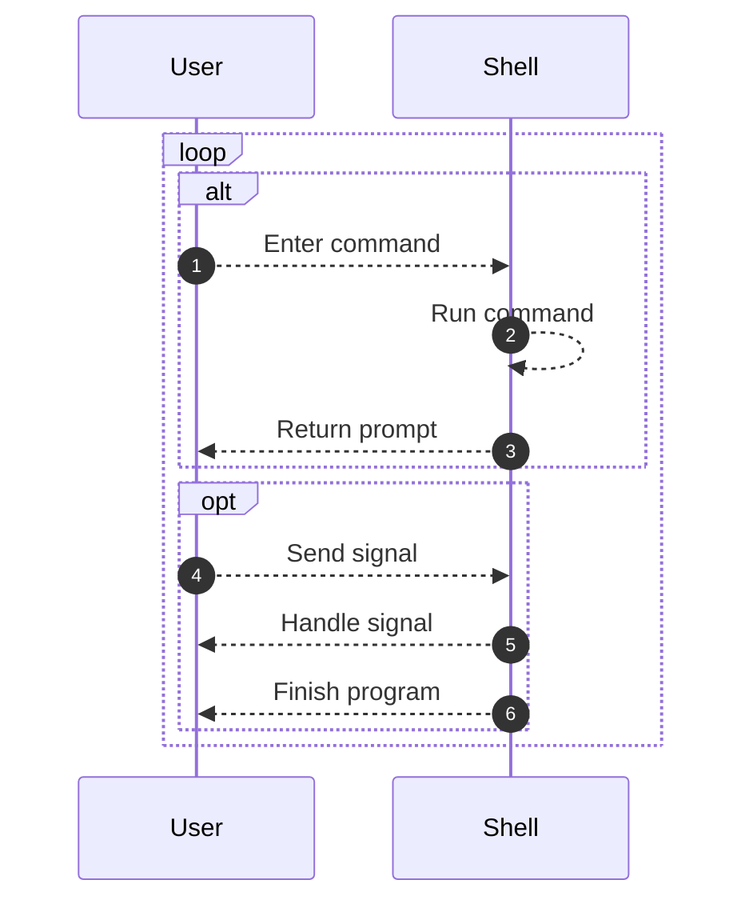
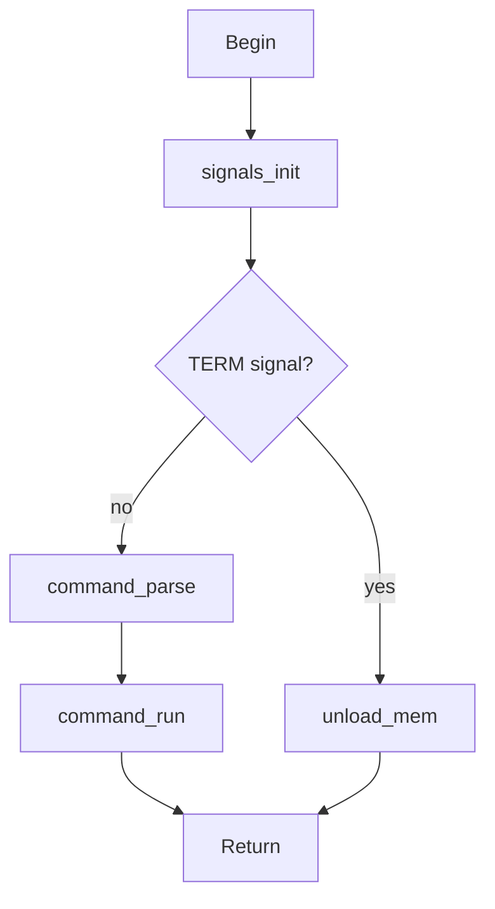
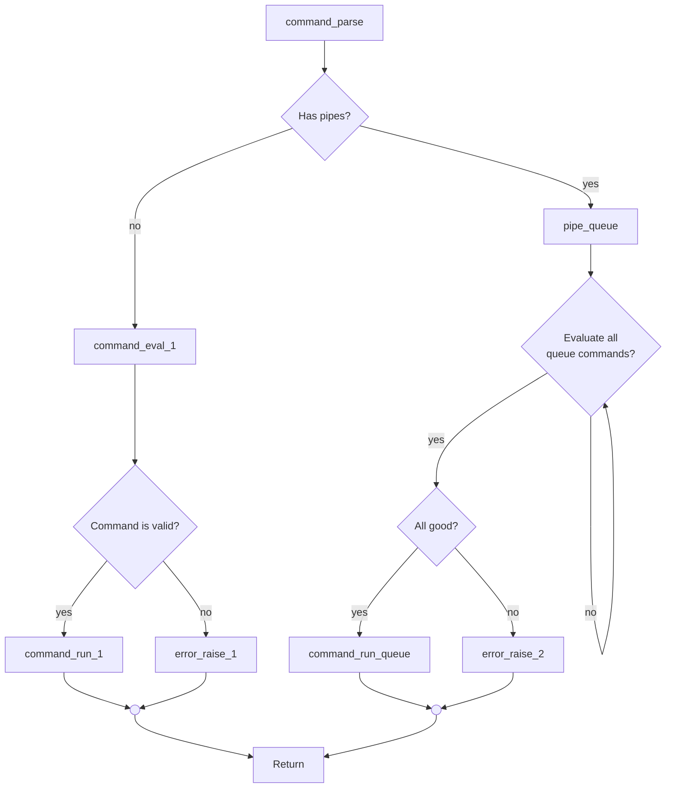
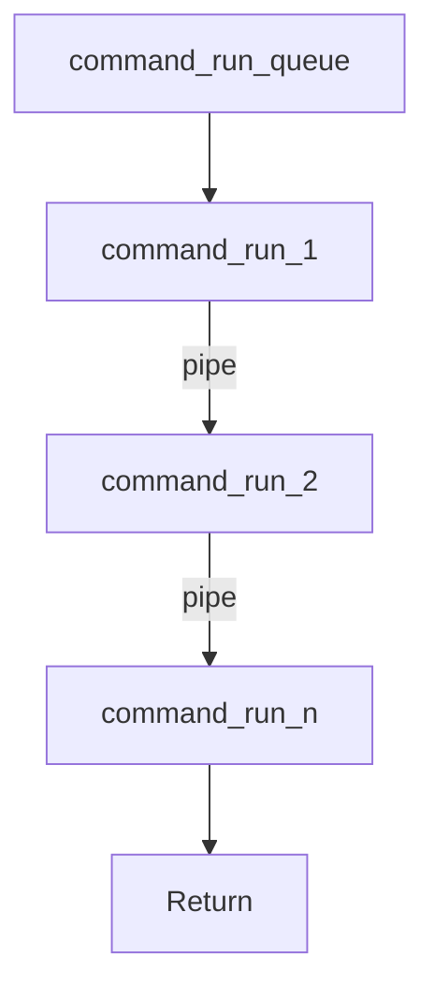
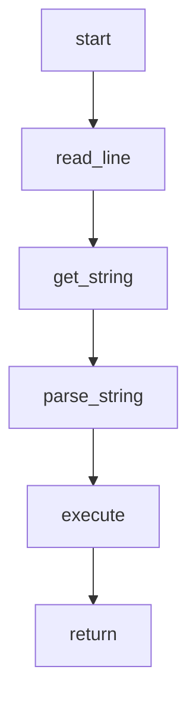

## Basic interaction

## Main structure

**Parsing**

### To Dos

- Built-ins
- Handle history

// get_string -> echo "hi mom"
// parse_string -> cortar echo e hi mom
// exec -> fork/ pid/ stdout

