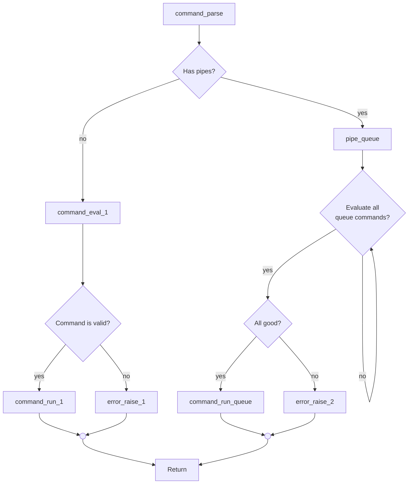

```mermaid
	flowchart TD
	c1(( ))
	c2(( ))

	command_parse -->
	has_pipe{Has pipes?} -- yes --> pipe_queue
	has_pipe{Has pipes?} -- no --> command_eval_1

	command_eval_1 -->
	command_isvalid_1{Command is valid?} -- yes --> command_run_1
	command_isvalid_1{Command is valid?} -- no --> error_raise_1

	pipe_queue -->
	cmd_loop{"Evaluate all\nqueue commands?"} -- yes --> all_good
	cmd_loop{"Evaluate all\nqueue commands?"} -- no --> cmd_loop
	
	all_good{All good?} -- yes --> command_run_queue
	all_good{All good?} -- no --> error_raise_2

	command_run_1 -->
	c1 
	
	error_raise_1 --> 
	c1 
	
	command_run_queue -->
	c2 
	
	error_raise_2 -->
	c2 
	
	c1 -->
	Return
	
	c2 -->
	Return
```
