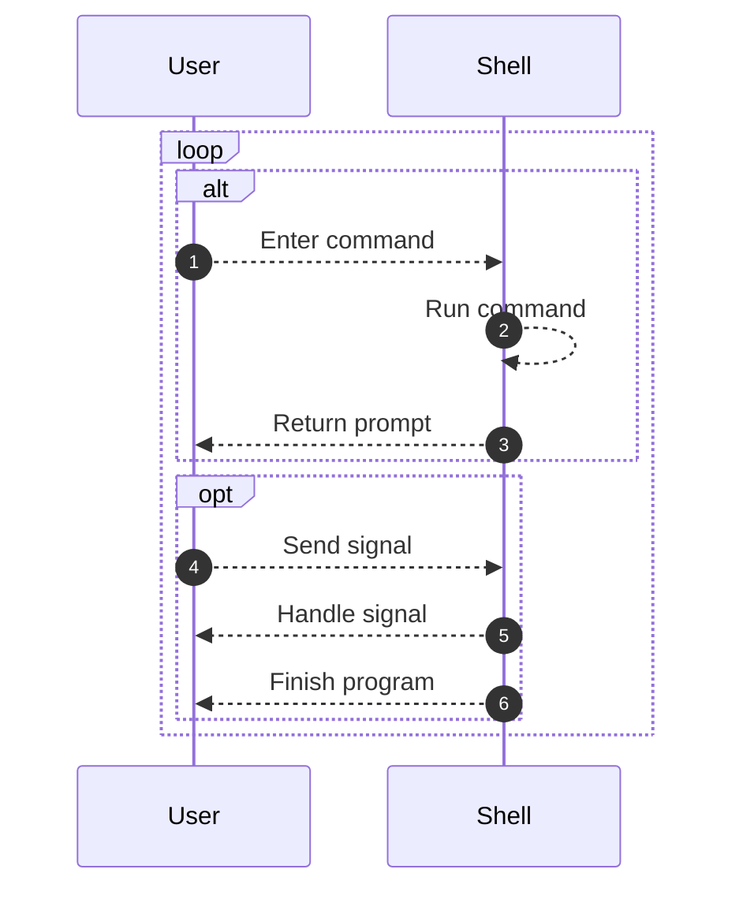

```mermaid
	sequenceDiagram
	autonumber

	participant User
	participant Shell

	loop
		alt
			User -->> Shell : Enter command
			Shell -->> Shell: Run command
			Shell -->> User : Return prompt
		end
		opt
			User -->> Shell : Send signal
			Shell -->> User : Handle signal
			Shell -->> User : Finish program
		end
	end

```
