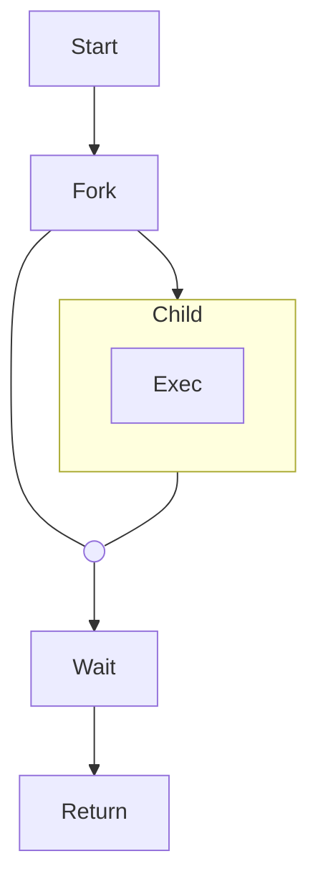

***diagram - basic use of fork and execve functions***



```
	flowchart TD
	if{"True?"} 
	c1(( ))

	Start([Start]) -->
	write[Input data: ] -->
	Read -->

	if -- yes --> parse
	if -- no --> unload

	parse -. save .-> 
	database[(Database)]

	unload ==> 
	mem{{Memory}} ---
	c1 -->
	Return([Return])
```

```
	flowchart LR
	 
	 A --> TOP --> B

	  subgraph TOP
	    direction TB
	    	 B1 --> B2
	  end

	    subgraph B1
	        direction RL
	        i1 -->f1
	    end

	    subgraph B2
	        direction BT
	        i2 -->f2
	    end
```
