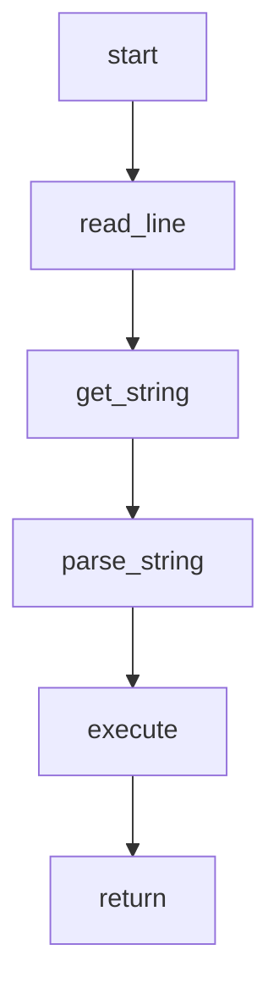

```mermaid
flowchart TD
start -->
read_line -->
get_string -->
parse_string -->
execute -->
return
```

// get_string -> echo "hi mom"
// parse_string -> cortar echo e hi mom
// exec -> fork/ pid/ stdout
