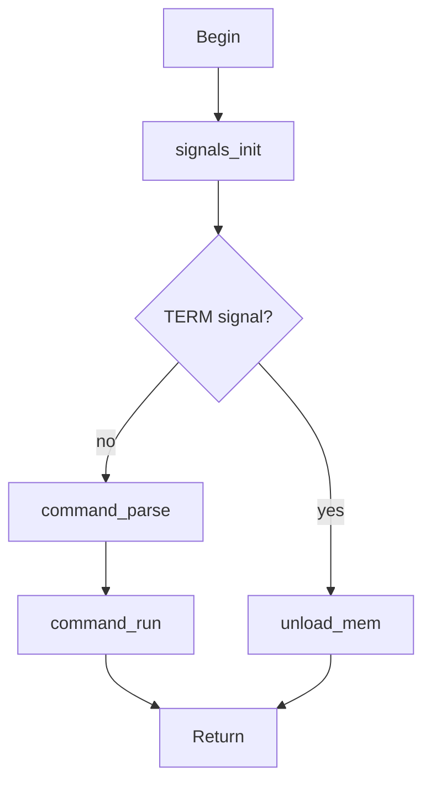

```mermaid
	flowchart TD

	Begin -->
	signals_init -->
	signal_terminate{TERM signal?} -- yes --> unload_mem
	signal_terminate{TERM signal?} -- no --> command_parse
	
	command_parse -->
	command_run -->
	Return

	unload_mem -->
	Return
```
