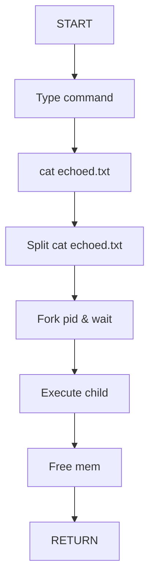
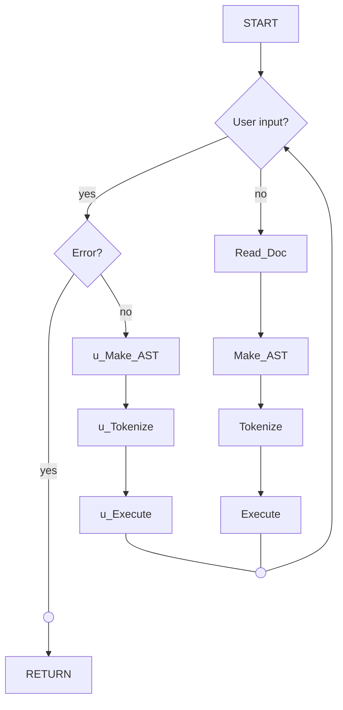
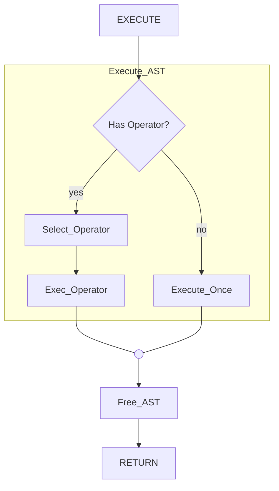
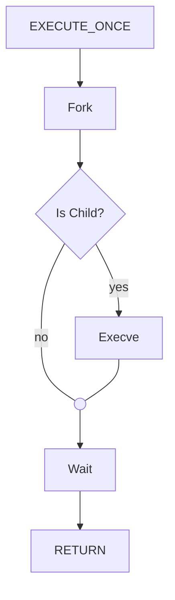
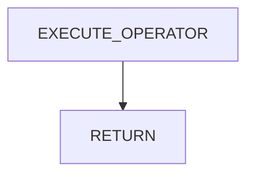

- [ ] feat_ Criar v001 do projeto
	- [ ] task_ Criar uma estrutura de dados
	- [ ] task_ Criar parser para o comando Echo
	- [ ] task_ Criar o executor que chame Echo e retorne

```mermaid
	flowchart TD
	START -->
	
	ask[Type command] -->
	read[cat echoed.txt] -->
	split[Split cat echoed.txt] -->
	forkwait[Fork pid & wait] -->
	execve[Execute child] -->
	free[Free mem] -->
	
	RETURN
```

```mermaid
	flowchart TD
	readuser{User input?}
	err_1{Error?}
	c1(( ))
	c2(( ))
	
	
	START -->
	readuser -- yes --> err_1
	readuser -- no --> Read_Doc
	
	Read_Doc -->
	Make_AST -->
	Tokenize -->
	Execute ---
	c2

	err_1 -- yes ------- c1
	err_1 -- no --> 
	u_Make_AST -->
	u_Tokenize -->
	u_Execute ---
	c2

	
	c2 -->
	readuser
	
	c1 -->
	RETURN
```

```mermaid
	flowchart TD
	hasOper{Has Operator?}
	c1(( ))
	

	EXECUTE -->
	hasOper
	

	Exec_Operator ---
	c1
	
	Execute_Once ---
	c1

	c1 -->
	Free_AST -->
	RETURN


	subgraph Execute_AST
		hasOper -- yes -->
			Select_Operator	-->
			Exec_Operator 

		hasOper -- no -->
			Execute_Once
	end
```

```mermaid
	flowchart TD
	isChild{Is Child?}
	c1(( ))
	
	EXECUTE_ONCE -->
	Fork -->
	isChild -- yes --> Execve
	isChild -- no --- c1

	Execve ---
	c1 -->
	Wait -->
	RETURN
```

```mermaid
	flowchart TD

	EXECUTE_OPERATOR -->
	RETURN
```