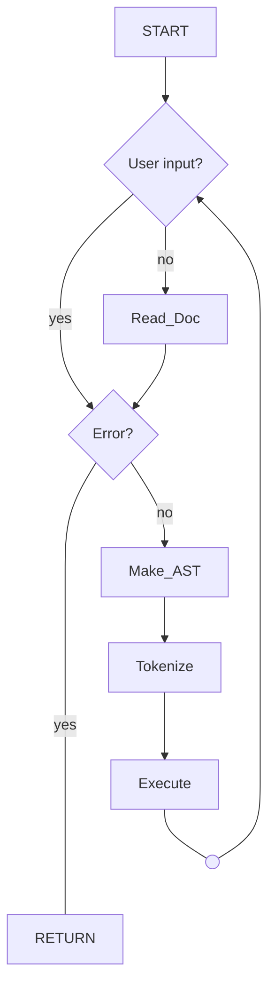
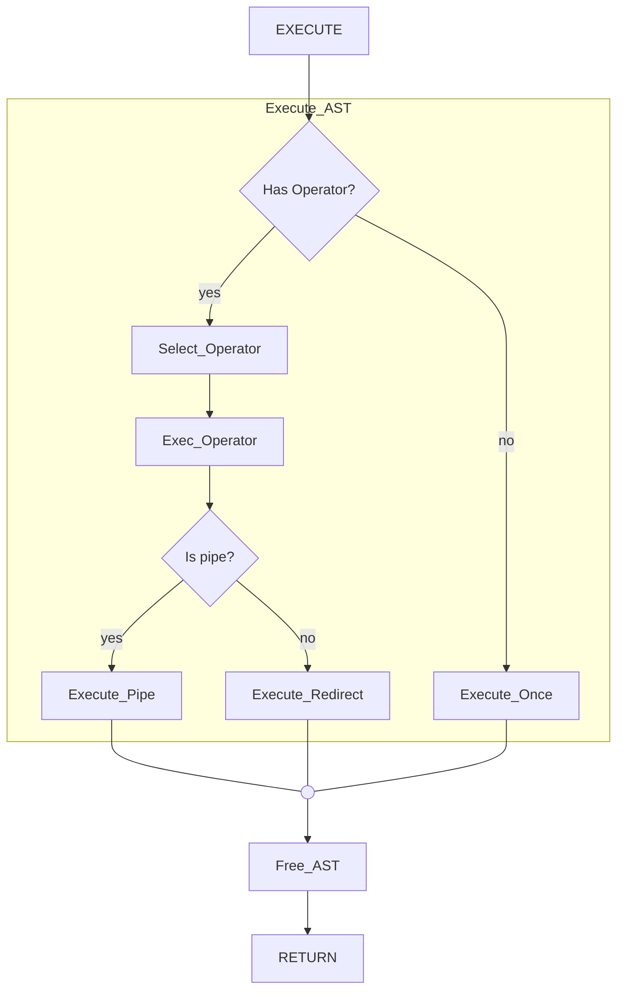
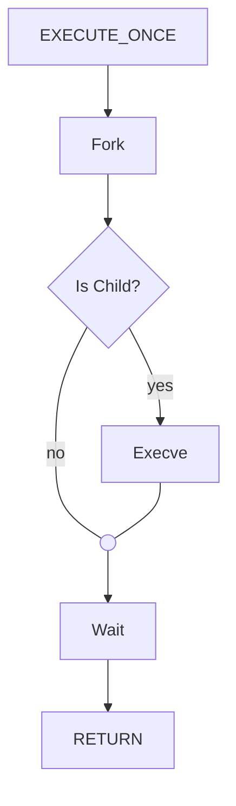
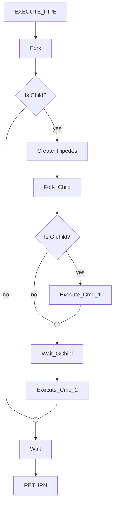
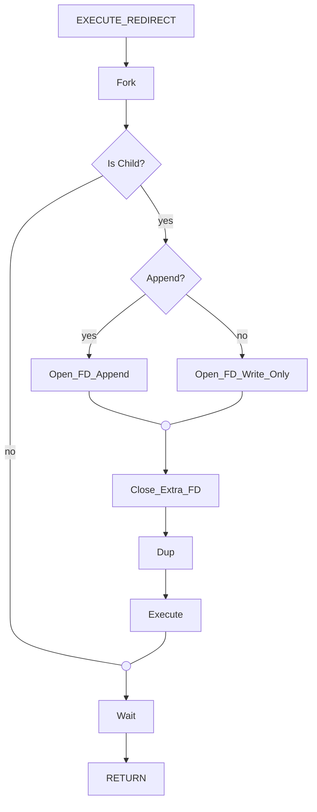

- [ ] feat_ Criar v0.1 do projeto
	- [ ] task_ Criar uma estrutura de dados
	- [ ] task_ Criar parser para o comando Echo
	- [ ] task_ Criar o executor que chame Echo e retorne


```
cat echoed.txt > void.txt | sort < tail void.txt | grep pirate | cat void.txt
```












