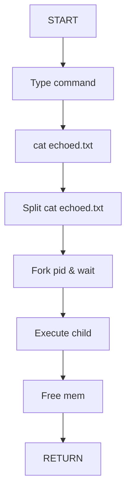

- [ ] feat_ Criar v001 do projeto
	- [ ] task_ Criar uma estrutura de dados
	- [ ] task_ Criar parser para o comando Echo
	- [ ] task_ Criar o executor que chame Echo e retorne

![[Pasted image 20230816092505.png]]

![[Pasted image 20230816092520.png]]

records e depois record
parte da deleção - porção minima (1 sys_id apenas)
CHG0252068