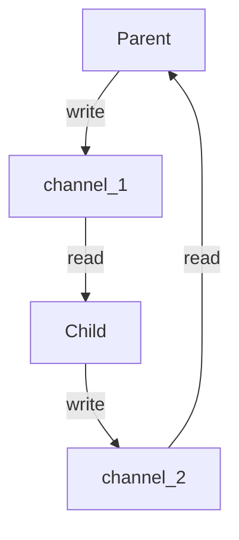

![[ref_ Allowed functions]]

# Notes - processes functions

## Fork

- Clone the calling process, creating an exact copy: the parent and the child, in the same code, but in separete mem spaces
	- clone 2^#calls
- Returns -1 or 0 for the pid of the child process

![[Pasted image 20230814145101.png]]

![[Pasted image 20230814204827.png]]

![[Pasted image 20230814204842.png]]

![[Pasted image 20230814204901.png]]


## Wait

- Stop execution until child finishes its execution
- It's important to put the wait funcion inside the code relative to the parent process (pid != 0)
- It checks if there is a child process, returns -1 otherwise
- `while (wait(NULL) != -1 || errno != ECHILD);`

## getpid and getppid

- get current pid
- get parent pid
- If a child process is still running when its original parent terminates, a new parent is assigned to the orphan child

## pipe

- pipe is a in-memory file
- It is a file that only has a buff
- We can open pipes with `pipe()`
	- It creates a one-way communication channel
	- `PIPEDES[0]` read; `PIPEDES[1]` write
	- pipe open 2 fd and save them into `PIPEDES[2]`
	- returns -1 in error
- `write(pipedes[1], arg, bytes);`
- `read(pipedes[0], arg, bytes);`

#### pipes AND fork

- first pipe, then fork
- when we fork, the pipes are copied over
- behind the scenes they are assigned to the newer created process, they get inherited
	- if we close the fd in one process, the fd remains open in the other process (they are independent)

**warning**

- we cannot have a pipe that send and received data in the same process

solution



## execve

- It replaces the memory of the process that called it

#### execve AND wait

```c
int status; 
wait (&status); 
if(WIFEXITED(status)) {
	int statuscode = WEXISTSTATUS(status);
	if (statuscode == 0)
		return (0);
}
```